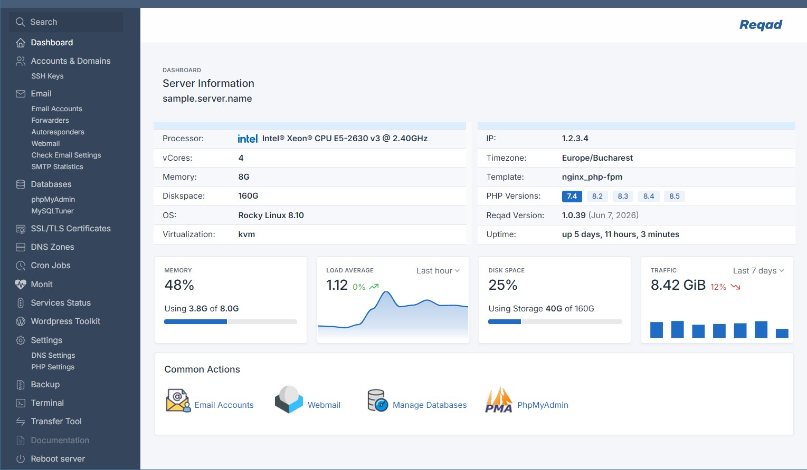

# Reqad - the alternate hosting control panel

[](LICENSE)
[](https://www.reqad.com/)
[](https://www.reqad.com/)

**Open source & self-hosted.** Reqad is a free control panel for Rocky Linux, AlmaLinux
and RHEL - manage hosting, email, DNS, SSL, WordPress and multiple PHP versions from one
clean dashboard.

cPanel-like ease without the licensing. Built for running your own domains or client sites
on a single VPS, with predictable costs.



## Features

- **Hosting accounts** - per-domain accounts with disk-usage monitoring
- **Email** - Exim + Dovecot + Roundcube webmail + SpamAssassin, with SPF, DKIM, SRS,
  forwarders and autoresponders
- **WordPress toolkit** - one-click install, subfolder detection, Wordfence integration
- **Multiple PHP versions** - per-account PHP 7.x/8.x with OPcache, APCu and a full
  `php.ini` editor
- **SSL/TLS** - Let's Encrypt & ACME certificates for the panel and every hosted domain
- **DNS management** - Cloudflare, cPanel and PowerDNS providers, with wildcard support
- **Databases** - MySQL/MariaDB with phpMyAdmin
- **cPanel migration** - import existing accounts with domains, mail and databases
- **File manager** - account-level, with CodeMirror editor, bulk operations, chmod and
  archive support
- **More tools** - browser terminal, SSH keys, cron jobs, backups and service control

## Requirements

- **OS:** Rocky Linux, AlmaLinux or RHEL 8 / 9
- **A reqad.com account** - free registration at [reqad.com](https://www.reqad.com/)

**Stack it manages:** Nginx / Apache · MariaDB · Exim / Dovecot · PHP / Roundcube ·
PowerDNS / Cloudflare · Let's Encrypt · WordPress · Monit · CSF firewall.

## Installation

One command on a fresh EL8/EL9 server - sets up the webstack, MariaDB, mail and SSL
automatically:

```bash
export SSH_PORT=1922
export TIMEZONE='Europe/Bucharest'
export TEMPLATE='nginx_php-fpm'   # or: apache_modphp
export PHP_VERSION='8.3'          # 7.4, 8.2, 8.3, 8.4 or 8.5
export WITH_EMAIL=true            # omit to skip exim/dovecot
bash <(curl -sSL https://repo.reqad.net/install-el8.sh)
```

On EL9, use `install-el9.sh`.

## License

[GPL-3.0](LICENSE). 
