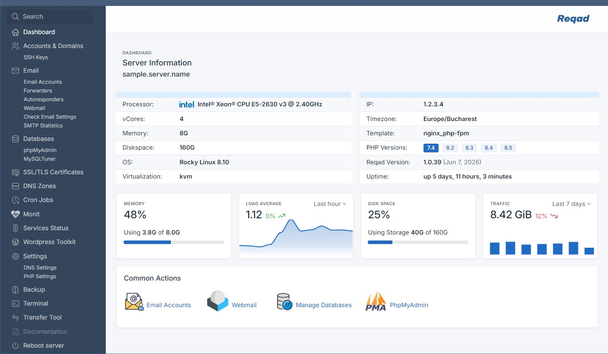

# Reqad - the alternate hosting control panel

[](LICENSE)
[](https://www.reqad.com/)
[](https://www.reqad.com/)

**Open source & self-hosted.** Reqad is a free control panel for Rocky Linux, AlmaLinux
and RHEL - manage hosting, email, DNS, SSL, WordPress and multiple PHP versions from one
clean dashboard.

cPanel-like ease without the licensing. Built for running your own domains or client sites
on a single VPS, with predictable costs.



## Features

- **Hosting accounts** - per-domain accounts with disk-usage monitoring
- **Email** - Exim + Dovecot + Roundcube webmail + SpamAssassin, with SPF, DKIM, SRS,
  forwarders and autoresponders
- **WordPress toolkit** - one-click install, subfolder detection, Wordfence integration
- **Multiple PHP versions** - per-account PHP 7.x/8.x with OPcache, APCu and a full
  `php.ini` editor
- **SSL/TLS** - Let's Encrypt & ACME certificates for the panel and every hosted domain
- **DNS management** - Cloudflare, cPanel and PowerDNS providers, with wildcard support
- **Databases** - MySQL/MariaDB with phpMyAdmin
- **cPanel migration** - import existing accounts with domains, mail and databases
- **File manager** - account-level, with CodeMirror editor, bulk operations, chmod and
  archive support
- **More tools** - browser terminal, SSH keys, cron jobs, backups and service control

## Requirements

- **OS:** Rocky Linux, AlmaLinux or RHEL 8 / 9 - a fresh, clean install
- **Architecture:** x86_64
- **Access:** root over SSH
- **A reqad.com account** - free registration at [reqad.com](https://www.reqad.com/)

**Stack it manages:** Nginx / Apache · MariaDB · Exim / Dovecot · PHP / Roundcube ·
PowerDNS / Cloudflare · Let's Encrypt · WordPress · Monit · CSF firewall.

## Installation

One command on a fresh EL8 or EL9 server - the same command for both, it detects which
one you are on:

```bash
bash <(curl -sSL https://repo.reqad.net/install.sh)
```

It checks the server, then opens a terminal UI to choose the web server, PHP version,
whether to install the mail stack, the SSH port and the timezone:

```
┌──────────────────────────────────────────────────────────┐
│ Rocky Linux 9.4 (Blue Onyx) · x86_64                     │
│ srv1.example.com   203.0.113.10   4 vCPU   7.8G RAM      │
├──────────────────────────────────────────────────────────┤
│ ▸ Web server    [ nginx + php-fpm ] [ apache + mod_php ] │
│   PHP version   [ 7.4 ] [ 8.2 ] [ 8.3 ] [ 8.4 ] [ 8.5 ]  │
│   Email stack   [ no ] [ yes ]                           │
│   SSH port      22                                       │
│   Timezone      Europe/Bucharest                         │
├──────────────────────────────────────────────────────────┤
│                    Start installation                    │
└──────────────────────────────────────────────────────────┘
  ↑↓ move · ←→ change · ⏎ select · q quit
```

Pick **Start installation** and it sets up the web stack, MariaDB, SSL and - if you asked
for it - the mail stack. A log of the run is kept at
`/var/tmp/reqad-install/install_reqad.log`.

### Unattended

Pass any option and the UI is skipped, using the defaults for anything you leave out:

```bash
bash <(curl -sSL https://repo.reqad.net/install.sh) \
  --template nginx_php-fpm \
  --php 8.4 \
  --email \
  --ssh-port 1922 \
  --timezone 'Europe/Bucharest'
```

| Option | Default | What it does |
| --- | --- | --- |
| `--template` | `nginx_php-fpm` | Web server stack: `nginx_php-fpm` or `apache_modphp` |
| `--php` | `8.3` | PHP version: `7.4`, `8.2`, `8.3`, `8.4` or `8.5` |
| `--email` / `--no-email` | *off* | Install Exim, Dovecot and Roundcube |
| `--ssh-port` | `22` | Moves SSH to another port and disables password auth |
| `--timezone` | *server's current* | Sets the server clock, e.g. `Europe/Bucharest` |
| `--skip-update` | — | Skips the initial system update and package install |
| `-y`, `--yes` | — | Runs with every default, no UI |
| `--dry-run` | — | Prints what would be installed and changes nothing |
| `--help` | — | Lists every option |

> **Note.** The installer does not read environment variables. The older
> `install-el8.sh` / `install-el9.sh` scripts, and the `SSH_PORT` / `TIMEZONE` /
> `TEMPLATE` / `PHP_VERSION` / `WITH_EMAIL` variables they used, are replaced by the
> single `install.sh` and the options above.

During early access the package repository is access-controlled: register at
[reqad.com](https://www.reqad.com/) and send the server's public IP so it can be
allow-listed before running the installer.

## License

[GPL-3.0](LICENSE).
